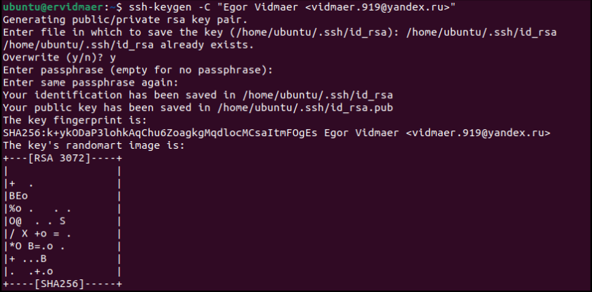
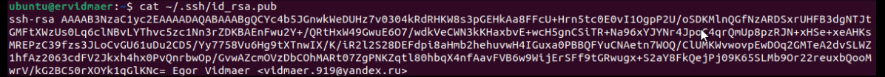
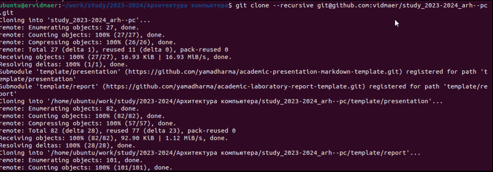
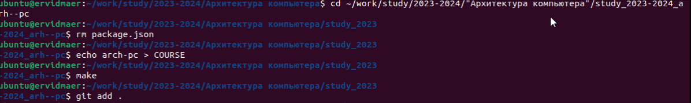
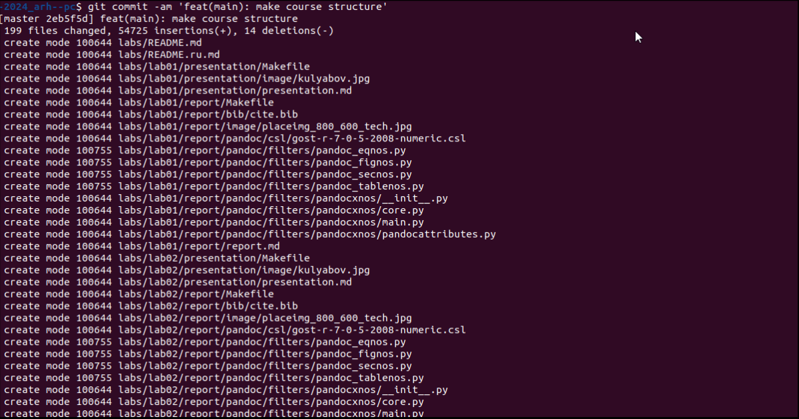
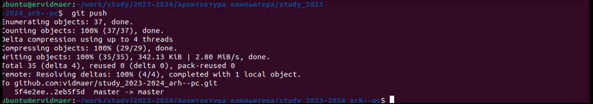

---
## Front matter
title: "Отчёт по лабораторной работе №2"
subtitle: "Система контроля версий Git"
author: "Видмаер Егор"

## Generic otions
lang: ru-RU
toc-title: "Содержание"

## Bibliography
bibliography: bib/cite.bib
csl: pandoc/csl/gost-r-7-0-5-2008-numeric.csl

## Pdf output format
toc: true # Table of contents
toc-depth: 2
lof: true # List of figures
lot: true # List of tables
fontsize: 12pt
linestretch: 1.5
papersize: a4
documentclass: scrreprt
## I18n polyglossia
polyglossia-lang:
  name: russian
  options:
	- spelling=modern
	- babelshorthands=true
polyglossia-otherlangs:
  name: english
## I18n babel
babel-lang: russian
babel-otherlangs: english
## Fonts
mainfont: PT Serif
romanfont: PT Serif
sansfont: PT Sans
monofont: PT Mono
mainfontoptions: Ligatures=TeX
romanfontoptions: Ligatures=TeX
sansfontoptions: Ligatures=TeX,Scale=MatchLowercase
monofontoptions: Scale=MatchLowercase,Scale=0.9
## Biblatex
biblatex: true
biblio-style: "gost-numeric"
biblatexoptions:
  - parentracker=true
  - backend=biber
  - hyperref=auto
  - language=auto
  - autolang=other*
  - citestyle=gost-numeric
## Pandoc-crossref LaTeX customization
figureTitle: "Рис."
tableTitle: "Таблица"
listingTitle: "Листинг"
lofTitle: "Список иллюстраций"
lotTitle: "Список таблиц"
lolTitle: "Листинги"
## Misc options
indent: true
header-includes:
  - \usepackage{indentfirst}
  - \usepackage{float} # keep figures where there are in the text
  - \floatplacement{figure}{H} # keep figures where there are in the text
---

# Цель работы

Изучить идеологию и применение средств контроля версий. 
Приобрести практические навыки по работе с системой git.

# Выполнение лабораторной работы
1. Создадим  учётную запись на сайте https://github.com/ и заполним основные данные.

2. Сделаем предварительную конфигурацию git. Откроем терминал и введём следующие команды, указав имя и email владельца репозитория.Настроим utf-8 в выводе сообщений git, зададим имя начальной ветки (будем называть её master), параметр autocrlf и параметр safecrlf.

{ #fig:01 width=90% }

3. Для последующей идентификации пользователя на сервере репозиториев  сгенерируем пару ключей, далее загружаем сгенерённый открытый ключ, cкопировав из локальной консоли ключ в буфер обмена.

{ #fig:02 width=90% }

{ #fig:03 width=90% }

4. Откроем терминал и создадим каталог для предмета «Архитектура компьютера».

{ #fig:04 width=90% }

9. Клонируем созданный репозиторий.

{ #fig:05 width=90% }

10. Перейдём в каталог курса и удалим лишние файлы и отправим их на сервер

{ #fig:06 width=90% }

{ #fig:06 width=90% }

{ #fig:06 width=90% }

12. Проверим правильность создания иерархии рабочего пространства в локальном репозитории и на странице github.

# Выводы

Я изучила идеологию и применение средств контроля версий, и приобрела навыки по работе с системой git
