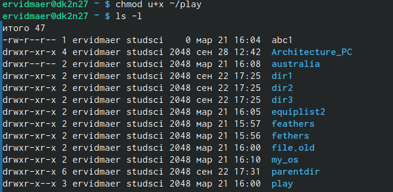

---
## Front matter
lang: ru-RU
title: Лабораторная работа №7
subtitle: "Анализ файловой системы Linux.Команды для работы с файлами и каталогами"
author:
  - Видмаер Егор
institute:
  - Российский университет дружбы народов, Москва, Россия

## i18n babel
babel-lang: russian
babel-otherlangs: english

## Formatting pdf
toc: false
toc-title: Содержание
slide_level: 2
aspectratio: 169
section-titles: true
theme: metropolis
header-includes:
 - \metroset{progressbar=frametitle,sectionpage=progressbar,numbering=fraction}
 - '\makeatletter'
 - '\beamer@ignorenonframefalse'
 - '\makeatother'
---

# Информация

## Докладчик

:::::::::::::: {.columns align=center}
::: {.column width="70%"}

  * Видмаер Егор
  * студент НБИбд-01-23 
  * Российский университет дружбы народов

:::
::: {.column width="30%"}

:::
::::::::::::::

# Вводная часть
 
## Вводная часть 

В данной лабораторной работе мы рассмотрим:
- Команды для работы с файлами и каталогами
- Копирование файлов и каталогов
- Перемещение и переименование файлов и каталогов
- Права доступа
- Изменение прав доступа
- Анализ файловой системы

## Объект и предмет исследования

- Команда touch - Команда fsck - Команда mkfs - Команда kill
- Команда mount - Команда cat - Команда less - Команда ls
- Команда chmod - Команда rm - Команда cp - Команда mv

# Цель работы

## Цель работы

   Целью лабораторной работы является ознакомление с файловой системой Linux, её структурой, именами и содержанием
каталогов. Приобретение практических навыков по применению команд для работы
с файлами и каталогами, по управлению процессами (и работами), по проверке исполь-
зования диска и обслуживанию файловой системы.

# Выполнение лабораторной работы

# Первый этап

## 1
   Выполняем все примеры, приведённые в первой части описания лабораторной работы.

{#fig:001 width=70%}

#

# Второй этап

##  2
2.1. Скопируем файл /usr/include/sys/io.h в домашний каталог и назовите его
equipment. 
2.2. В домашнем каталоге создадим директорию ~/ski.plases.
2.3. Переместите файл equipment в каталог ~/ski.plases.
2.4. Переименуйте файл ~/ski.plases/equipment в ~/ski.plases/equiplist.

{#fig:001 width=60%}

## 2

2.5. Создадим в домашнем каталоге файл abc1 и скопируйте его в каталог
~/ski.plases, назовите его equiplist2.
2.6. Создадим каталог с именем equipment в каталоге ~/ski.plases.
2.7. Переместим файлы ~/ski.plases/equiplist и equiplist2 в каталог
~/ski.plases/equipment.
2.8. Создадим и переместим каталог ~/newdir в каталог ~/ski.plases и назовем
его plans.

{#fig:001 width=70%}
  

# Третий этап

## 3

Определим опции команды chmod, необходимые для того, чтобы присвоить перечис-
ленным ниже файлам выделенные права доступа, считая, что в начале таких прав
нет

## 3.1
drwxr--r-- ... australia

{#fig:001 width=70%}

## 3.2
  drwx--x--x ... play

{#fig:001 width=70%}

## 3.3
-r-xr--r-- ... my_os

{#fig:001 width=70%}
    
## 3.4
 -rw-rw-r-- ... feathers

{#fig:001 width=70%}

# Четвёртый этап

## 4
4.1. Просмотриь содержимое файла /etc/password. (такой файл отсутствует)
4.2. Скопируйте файл ~/feathers в файл ~/file.old.ls
4.3. Переместите файл ~/file.old в каталог ~/play.
4.4. Скопируйте каталог ~/play в каталог ~/fun.
4.5. Переместите каталог ~/fun в каталог ~/play и назовите его games.

{#fig:001 width=70%}

## 4

4.6. Лишим владельца файла ~/feathers права на чтение.
4.7. Что произойдёт, если вы попытаетесь просмотреть файл ~/feathers командой
cat?
4.8. Что произойдёт, если вы попытаетесь скопировать файл ~/feathers?

{#fig:001 width=60%}

## 4

4.9. Дайте владельцу файла ~/feathers право на чтение.

{#fig:001 width=70%}

## 4

4.10. Лишим владельца каталога ~/play права на выполнение.
4.11. Перейдем в каталог ~/play. Что произошло? ничего не произошло(

{#fig:001 width=70%}

## 4
4.12. Дайте владельцу каталога ~/play право на выполнение.

{#fig:001 width=70%}

# Пятый этап

## 5

Прочитаем man по командам mount, fsck, mkfs, kill и кратко их охарактеризуем,
приведя примеры.

{#fig:001 width=40%}

## 5

{#fig:001 width=70%}

## 5

{#fig:001 width=70%}

## 5

{#fig:001 width=70%}

# Вывод

## Выводы

Мы ознакомились с файловой системой Linux, её структурой, именами и содержанием
каталогов. Приобрели практические навыки по применению команд для работы
с файлами и каталогами, по управлению процессами (и работами), по проверке исполь-
зования диска и обслуживанию файловой системы.

