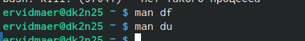

---
## Front matter
lang: ru-RU
title: Лабораторная работа №8
subtitle: "Поиск файлов. Перенаправление
ввода-вывода. Просмотр запущенных процессов"
author:
  - Видмаер Егор.
institute:
  - Российский университет дружбы народов, Москва, Россия

## i18n babel
babel-lang: russian
babel-otherlangs: english

## Formatting pdf
toc: false
toc-title: Содержание
slide_level: 2
aspectratio: 169
section-titles: true
theme: metropolis
header-includes:
 - \metroset{progressbar=frametitle,sectionpage=progressbar,numbering=fraction}
 - '\makeatletter'
 - '\beamer@ignorenonframefalse'
 - '\makeatother'
---

# Информация

## Докладчик

:::::::::::::: {.columns align=center}
::: {.column width="70%"}

  * Видмаер Егор
  * студент НБИбд-01-23
  * Российский университет дружбы народов

:::
::: {.column width="30%"}

:::
::::::::::::::

# Вводная часть
 
## Вводная часть 
 В операционной системе типа Linux взаимодействие пользователя с системой обычно
осуществляется с помощью командной строки посредством построчного ввода ко-
манд. При этом обычно используется командные интерпретаторы языка shell: /bin/sh;
/bin/csh; /bin/ksh.
 Формат команды. Командой в операционной системе называется записанный по
специальным правилам текст (возможно с аргументами), представляющий собой ука-
зание на выполнение какой-либо функций (или действий) в операционной системе.
Обычно первым словом идёт имя команды, остальной текст — аргументы или опции,
конкретизирующие действие.

## Объект и предмет исследования

- Перенаправление ввода-вывода
- Конвейер
- Поиск файла
- Проверка использования диска
- Управление процессами
- Получение информации о процессах

# Цель работы

## Цель работы

  Ознакомление с инструментами поиска файлов и фильтрации текстовых данных.
Приобретение практических навыков: по управлению процессами (и заданиями), по
проверке использования диска и обслуживанию файловых систем.

# Выполнение лабораторной работы

## 1
   Осуществите вход в систему, используя соответствующее имя пользователя.

## 2

 Запишем в файл file.txt названия файлов, содержащихся в каталоге /etc. Допи-
шите в этот же файл названия файлов, содержащихся в вашем домашнем каталоге

{#fig:001 width=50%}

 
## 3
  Выведем имена всех файлов из file.txt, имеющих расширение .conf, после чего
запиши их в новый текстовой файл conf.txt. 

{#fig:002 width=50%}

##

{#fig:003 width=50%}

 
## 4

 Определим какие файлы в домашнем каталоге начинаются с 
символа с. 
    
{#fig:004 width=50%}

## 5

 Выведем на экран имена файлов из каталога /etc, начинающиеся 
с символа h

##

{#fig:005 width=50%}
## 

{#fig:006 width=50%}

## 6

 Запустим в фоновом режиме процесс, который будет записывать в файлы ~/logfile файлы, имена которые
 начинаются с log, удалим logfile.1

##

 {#fig:007 width=50%}

## 7

 Запустим из консоли в фоновом редиме gedit.
 
{#fig:008 width=50%}

## 8
 Определим индефикатор процесса с помощью команды ps 

{#fig:009 width=50%}

## 9
 Определим индефикатор процесса с помощью команды ps 

{#fig:010 width=50%}

## 10
 Изучим команду kill и с помощью неё прекратим gedit

##
{#fig:011 width=50%}

##
{#fig:012 width=50%}

## 11
 Изучим и выполним команды df и du
{#fig:013 width=50%}

##
{#fig:014 width=50%}

##
{#fig:015 width=50%}

##
{#fig:016 width=70%}

## 12
 С помощью команды find выведем именя всех директорий 

##
{#fig:001 width=50%}

##
{#fig:001 width=50%}

# Вывод

## Выводы

Мы ознакомились с инструментами поиска файлов и фильтрации текстовых данных.
Приобрели практические навыки: по управлению процессами (и заданиями), по
проверке использования диска и обслуживанию файловых систем.

