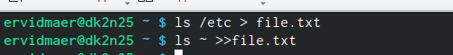
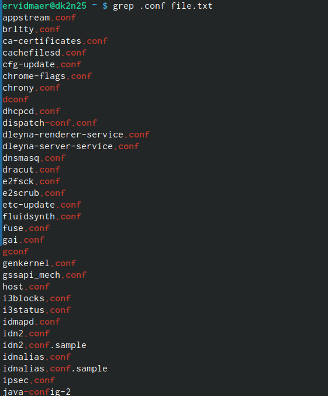
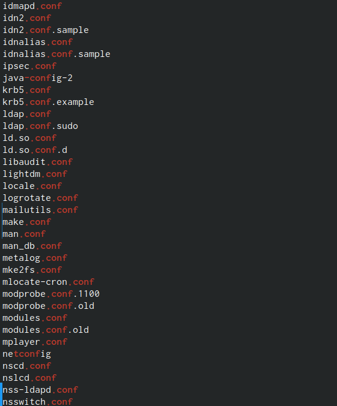
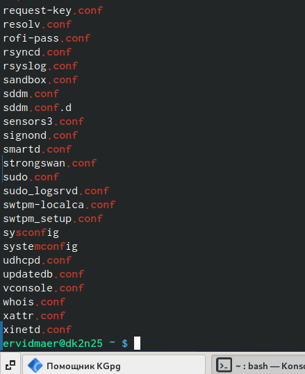
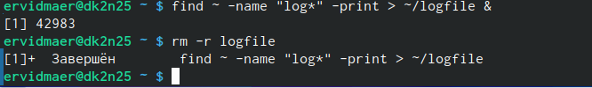
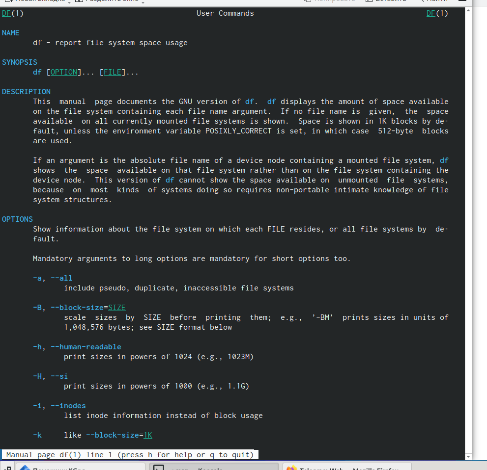
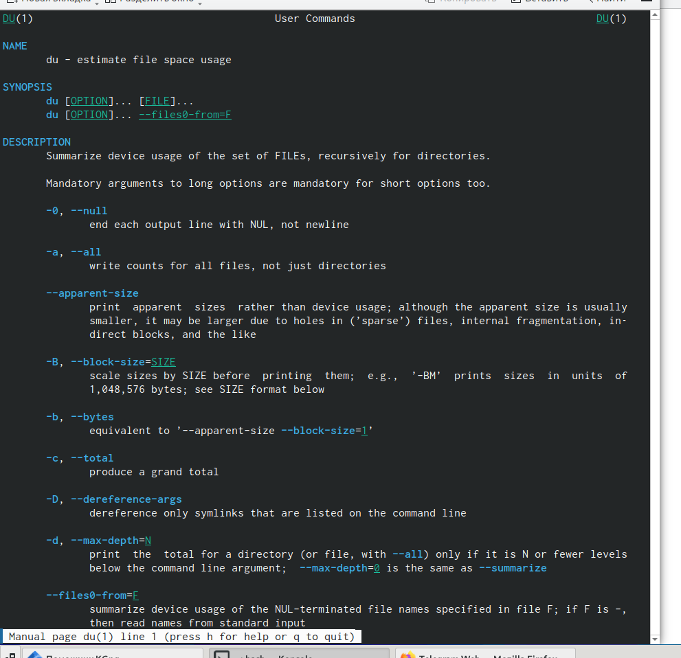

---
## Front matter
title: "Лабораторная работа №8"
subtitle: "Поиск файлов. Перенаправление
ввода-вывода. Просмотр запущенных процессов"
author: "Видмаер Егор"

## Generic otions
lang: ru-RU
toc-title: "Содержание"

## Bibliography
bibliography: bib/cite.bib
csl: pandoc/csl/gost-r-7-0-5-2008-numeric.csl

## Pdf output format
toc: true # Table of contents
toc-depth: 2
lof: true # List of figures
lot: true # List of tables
fontsize: 12pt
linestretch: 1.5
papersize: a4
documentclass: scrreprt
## I18n polyglossia
polyglossia-lang:
  name: russian
  options:
	- spelling=modern
	- babelshorthands=true
polyglossia-otherlangs:
  name: english
## I18n babel
babel-lang: russian
babel-otherlangs: english
## Fonts
mainfont: PT Serif
romanfont: PT Serif
sansfont: PT Sans
monofont: PT Mono
mainfontoptions: Ligatures=TeX
romanfontoptions: Ligatures=TeX
sansfontoptions: Ligatures=TeX,Scale=MatchLowercase
monofontoptions: Scale=MatchLowercase,Scale=0.9
## Biblatex
biblatex: true
biblio-style: "gost-numeric"
biblatexoptions:
  - parentracker=true
  - backend=biber
  - hyperref=auto
  - language=auto
  - autolang=other*
  - citestyle=gost-numeric
## Pandoc-crossref LaTeX customization
figureTitle: "Рис."
tableTitle: "Таблица"
listingTitle: "Листинг"
lofTitle: "Список иллюстраций"
lotTitle: "Список таблиц"
lolTitle: "Листинги"
## Misc options
indent: true
header-includes:
  - \usepackage{indentfirst}
  - \usepackage{float} # keep figures where there are in the text
  - \floatplacement{figure}{H} # keep figures where there are in the text
---

# Цель работы

Ознакомление с инструментами поиска файлов и фильтрации текстовых данных.
Приобретение практических навыков: по управлению процессами (и заданиями), по
проверке использования диска и обслуживанию файловых систем.

# Задание

1. Осуществите вход в систему, используя соответствующее имя пользователя.
2. Запишите в файл file.txt названия файлов, содержащихся в каталоге /etc. Допи-
шите в этот же файл названия файлов, содержащихся в вашем домашнем каталоге.
3. Выведите имена всех файлов из file.txt, имеющих расширение .conf, после чего
запишите их в новый текстовой файл conf.txt.
4. Определите, какие файлы в вашем домашнем каталоге имеют имена, начинавшиеся
с символа c? Предложите несколько вариантов, как это сделать.
5. Выведите на экран (по странично) имена файлов из каталога /etc, начинающиеся
с символа h.
6. Запустите в фоновом режиме процесс, который будет записывать в файл ~/logfile
файлы, имена которых начинаются с log.
7. Удалите файл ~/logfile.
8. Запустите из консоли в фоновом режиме редактор gedit.
9. Определите идентификатор процесса gedit, используя команду ps, конвейер и фильтр
grep. Как ещё можно определить идентификатор процесса?
10. Прочтите справку (man) команды kill, после чего используйте её для завершения
процесса gedit.
11. Выполните команды df и du, предварительно получив более подробную информацию
об этих командах, с помощью команды man.
12. Воспользовавшись справкой команды find, выведите имена всех директорий, имею-
щихся в вашем домашнем каталоге

# Теоретическое введение

- Перенаправление ввода-вывода

В системе по умолчанию открыто три специальных потока:
– stdin — стандартный поток ввода (по умолчанию: клавиатура), файловый дескриптор
0;
– stdout — стандартный поток вывода (по умолчанию: консоль), файловый дескриптор
1;
– stderr — стандартный поток вывод сообщений об ошибках (по умолчанию: консоль),
файловый дескриптор 2.
Большинство используемых в консоли команд и программ записывают результаты
своей работы в стандартный поток вывода stdout. Например, команда ls выводит в стан-
дартный поток вывода (консоль) список файлов в текущей директории. Потоки вывода
и ввода можно перенаправлять на другие файлы или устройства. Проще всего это делается
с помощью символов >, >>, <, <<.

- Конвейер

Конвейер (pipe) служит для объединения простых команд или утилит в цепочки, в ко-
торых результат работы предыдущей команды передаётся последующей.
Конвейеры можно группировать в цепочки и выводить с помощью перенаправления
в файл

- Поиск файла

Команда find используется для поиска и отображения на экран имён файлов, соответ-
ствующих заданной строке символов.

- Фильтрация текста

Найти в текстовом файле указанную строку символов позволяет команда grep.
Кроме того, команда grep способна обрабатывать стандартный вывод других команд
(любой текст). Для этого следует использовать конвейер, связав вывод команды с вводом
grep.

- Проверка использования диска

Команда df показывает размер каждого смонтированного раздела диска
Команда du показывает число килобайт, используемое каждым файлом или каталогом.
Управление задачами
Любую выполняющуюся в консоли команду или внешнюю программу можно запустить
в фоновом режиме. Для этого следует в конце имени команды указать знак амперсанда
&.

- Управление процессами

Любой команде, выполняемой в системе, присваивается идентификатор процесса
(process ID). Получить информацию о процессе и управлять им, пользуясь идентифи-
катором процесса, можно из любого окна командного интерпретатора

- Получение информации о процессах

Команда ps используется для получения информации о процессах

# Выполнение лабораторной работы

1. Осуществите вход в систему, используя соответствующее имя пользователя.

2. Запишим в файл file.txt названия файлов, содержащихся в каталоге /etc. Допи-
шите в этот же файл названия файлов, содержащихся в вашем домашнем каталоге

{#fig:001 width=70%}

    
3. Выведем имена всех файлов из file.txt, имеющих расширение .conf, после чего
запиши их в новый текстовой файл conf.txt. 

{#fig:002 width=70%}

{#fig:003 width=70%}

    

4. Оределим какие файлы в домашнем каталоге начинаются с 
символа с. 
    
{#fig:004 width=70%}

5. Выведем на экран имена файлов из каталога /etc, начинающиеся 
с символа h

{#fig:005 width=70%}
{#fig:006 width=70%}

6. Запустим в фоновом режиме процесс, который будет записывать в файл ~/logfile файлы, имена который начинаются с log, удалим logfile.

{#fig:007 width=70%}

7. Запустим из консоли в фоновом редиме gedit.
 
{#fig:008 width=70%}

8. Определим индефикатор процесса с помощью команды ps 

{#fig:009 width=70%}

9. Определим индефикатор процесса с помощью команды ps 

{#fig:010 width=70%}

10. Изучим команду kill и с помощью неё прекратим gedit

{#fig:011 width=70%}

{#fig:012 width=70%}

11. Изучим и выполним команды df и du
{#fig:013 width=70%}

{#fig:014 width=70%}

{#fig:015 width=70%}

{#fig:016 width=70%}

12. С помощью команды find выведем именя всех директорий 
{#fig:017 width=70%}
{#fig:018 width=70%}

# Выводы

Мы ознакомились с инструментами поиска файлов и фильтрации текстовых данных.
Приобрели практические навыки: по управлению процессами (и заданиями), по
проверке использования диска и обслуживанию файловых систем.

# Контрольные вопросы

# Список литературы{.unnumbered}

